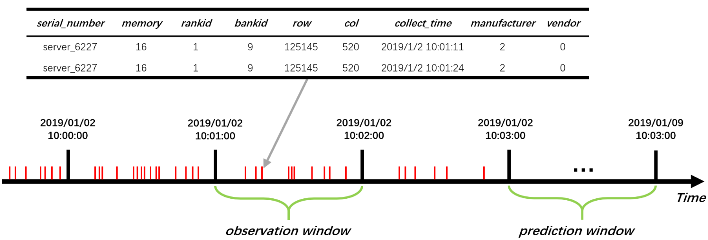
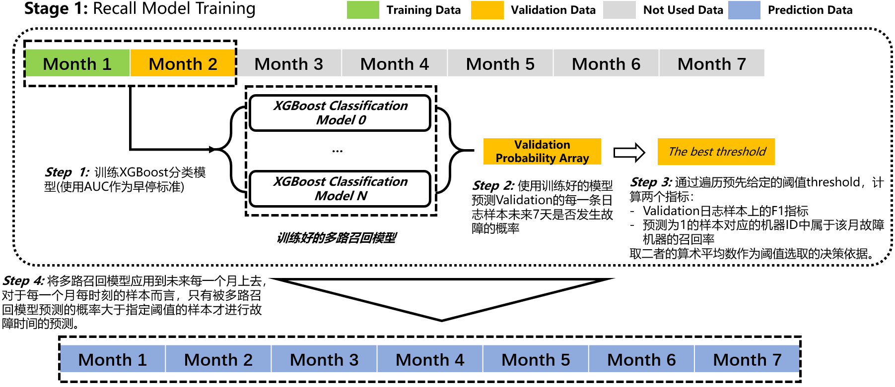

## PAKDD 2021 && 阿里云智能运维算法大赛

---
### **队伍简介**

队名：OutOfMemory，队长：鱼丸粗面（zhuoyin94@163.com），邮箱：zhuoyin94@163.com。初赛A榜2/1350，初赛Metric的F1值62.37；初赛B榜2/1350，初赛Metric的F1值为64.52；复赛代码上线工业级流水线测评环境，复赛A榜12/1350，分数为30.95，复赛B轮排名7/1350，分数28.63；综合答辩排名5/1350，获得优胜奖与PAKDD 2021 workshop最佳论文奖。（20210204）

**应主办方要求，本方案代码暂不开源。若后续有开源计划，请移步此[Github开源仓库](https://github.com/MichaelYin1994/tianchi-pakdd-aiops-2021)。**

---
### **系统环境与主要依赖packages**

- 系统环境: Ubuntu 18.04 LTS
- GPU: Quadro P5000(16G)
- CPU: Intel® Core™ i9-9820X CPU @ 3.30GHz × 20
- RAM: 32G
- CUDA: 10.1
- swap: 64G
- python == 3.6.9
- pandas == 1.0.4
- numba == 0.49.0
- numpy == 1.18.1
- xgboost == 1.2.1
- scikit-learn == 0.22.2
- scipy == 1.4.1
- tensorflow-gpu == 2.1.0

---
### **思路说明**

本方案整体模型架构上参考了搜索排序系统的建模方式[1]与去年的磁盘寿命预测冠军方案[12]，整体特征工程上参考了内存故障原理研究的相关文献[2][3][4][5][6][7]，特征工程的编码实现上采用了基于numba的高效优化[8]，模型训练上采用了基于GPU的XGBoost模型[9][10]。并且本方案在编码过程中尽量执行了较为严格的自行CodeRievew和基于pylint的风格检查[11]，以及覆盖了一部分关键代码的单元自测。本团队在初赛A轮与B轮均取得第2名成绩；复赛排名A轮第12，B轮排名第7。以下为本方案各部分的详细介绍。

#### **特征工程部分**

我们以Memory Address Log表为主来说明特征构造的基础思路。首先，对于Memory Address Log而言，其日志序列如下图所示。定义观测窗口序列为从2019-01-01 00:00:00时间开始，以固定时间间隔排序的有序ID序列。如上图所示，观测窗口大小为1min，对应的窗口ID为6120，6121与6122。每一个观测窗口可能包括0条或者多条日志信息，每条日志包含一系列的Meta Information，例如针对Memory Address Log而言是Error发生的时间点，Serial Number，Memory ID，Bank ID等信息，对于Mce Log而言则是Mca Bank ID等信息。

 

本方案的特征工程基于观测窗口进行。对于Memory Address Log而言，主要分为以下两种类型的特征：

- **一般性统计特征**：一般性统计特征主要是针对逐条Error日志提取历史窗口内的一些统计特征。例如对于每一条日志，提取从该日志发生时间的给定的过去窗口范围内，例如过去3分钟、30分钟、120分钟内的日志数量，然后观测窗口ID的信息进行聚合（Groupby），提取每个观测窗口上的统计量及其按时间进行shift的特征。除此之外也提取了诸如每条日志与上K条日志的时间差特征，该日志过去持续的unique的天数等特殊的特征。该种类型特征的提取采用了基于numba的njit工具加速过的utils.njit_window_group_count_diff方法，并采用双指针的方式提取给定窗口范围内的统计量，提升了特征提取速度（O(n)的时间与空间复杂度，经过numba加速更比原生Python提高几十倍的效率）。依据论文[3][5][6]，此种一般性统计特征主要捕获了内存Soft Error或者叫做Corrected Error的一系列的统计特性。

- **特殊统计特征提取**：依据相关论文提取的统计特征。例如对于每一条Memory Address Log，提取从该日志发生时间的给定的过去窗口范围内，例如过去3分钟、30分钟、120分钟内的Unique的row & col的个数，或者Unique的rank ID的个数，然后观测窗口ID的信息进行聚合（Groupby），提取每个观测窗口上的统计量及其按时间进行shift的特征。此种特征依据论文[3][5][6]，主要为提取由于Bad Bits导致的Hard Faults特征，例如永久性的bits陷入0的Error特性。该种类型特征的提取同样采用了基于numba的njit工具加速过的utils.njit_window_group_unique_count方法，并采用双指针的方式提取给定窗口范围内的统计量。

对于Memory Address Log而言，可以以上方式提取每台机器的每一个观测窗口上的统计特征，对于Mce Log与Kernel Log而言，也可以以类似的方式提取类似的特征，最后按照Serial Number与时间窗口ID的信息将所有信息以Memory Address Log为主表进行Merge，并构造标签，完成特征工程部分的工作。

#### **解决方案各模块说明**

本方案设计的故障检测模型与故障时间预测模型，一方面借鉴了PAKDD 2020磁盘寿命预测的相关建模思路[12]，另一方面融合了搜索排序的建模思路[1]。具体来说，本方案包括以下两个阶段：

- **Stage 1（召回阶段）**：此处我们希望得到一个模型，假设该模型预测了未来每一个月的机器每一条日志对应的未来7天可能发生故障的概率。基于预测的概率，以一个月为单位，希望挑选一个决策阈值能够完成以下两个目标：
  - 首先，我们希望基于概率大于该给定阈值而筛选出来的日志所对应的机器里面，该月的故障机器的召回率应该尽量高。
  - 其次，我们基于该阈值，认为该月所有概率大于该阈值对应的日志样本未来7天确实会发生故障，所有小于该阈值对应的样本未来7天不会发生故障，那么基于这样得判断计算的该月整体日志样本的F1值尽量高。

- **Stage 2 part 1（故障检测阶段）**：此处我们希望设计一个模型，该模型基于上一阶段被召回的日志样本，检测从被召回的日志样本观测窗口时间右边界开始算起，该日志样本对应的机器距离损坏还有几天。此处模型便是[12]中提到的寿命预测回归策略，该模型的本质仍然是一个分类模型，不过我们认为设计这样的回归模型能够更好的捕获标签中的细节信息。

- **Stage 2 part 2（故障时间预测阶段）**：此处我们希望设计一个模型，该模型能够很好的预测Stage 2中被检测出来的机器距离故障的实际时间。

本方案两个阶段分别采用不同的模型达成以上的目的：对于召回阶段而言，本方案在部分数据上训练分类模型，并依据Validation数据上的预测概率确定一个合适的召回决策阈值，能够达到召回阶段设定的两个目标；对于故障检测侧阶段，则依据被上一阶段被召回的样本训练故障检测模型，该模型能够检测样本中对应的7天内会发生故障的样本及其对应的机器ID；对于故障时间预测模型，采用被召回的样本中确实7天内会发生故障的样本训练时间预测模型，并将该模型用于预测Stage 2 part 1中被检测出来的机器距离故障的时间。下图为本方案整体的一个基本说明。

 

本方案设计的模型的核心思想，其实是希望采用召回模型，能够尽量缓解样本分布不均匀的问题，并且滤除没有故障判断价值的一些信息，以便后续检测模型能够更好的进行故障样本的检测。但是此处的召回模型不能像搜索排序系统一样进行设计，不光要考虑机器的召回率，也要考虑样本的F1值，二者相互制衡。事实上，本方案召回阶段的设计思路，参考了KPI曲线异常检测中常用的极值概率预警模型[13]，简单来说对于KPI曲线就是高于极值阈值则报警，低于极值阈值则不报警。此处我们将阈值报警模型替换为了基于机器学习预测概率的召回模型。

 

在具体实现上，针对召回阶段而言，在初赛中本方案使用了如上图所示的策略。刚开始仅使用1月份的数据训练召回模型，并在2月份上进行验证。首先，以ROC-AUC为早停标准（或者PR-AUC指标），在1月份数据上训练集成召回模型并在2月份进行验证，每一路XGBoost采用不同的随机种子、不同的参数与不同的特征数进行训练，获取分类模型；随后我们计算及集成召回模型在2月份每一条日志样本上的概率预测平均值；随后我们遍历指定区间的概率阈值（例如0到0.15的概率阈值切分2048份），对于每一个阈值而言，计算以下两个指标：

- 2月份的日志数据在给定阈值的条件下的F1值。
- 2月份的日志数据在给定阈值条件下，计算预测为未来7天会坏的日志样本对应的机器ID的召回率。

取二者的算术平均值，计算分数，作为阈值的决策依据。在复赛中，我们则采用1月到4月数据作为训练数据，5月与7月数据作为validaiton数据训练集成召回模型。在实践中，我们也尝试了基于HBOS与Isolation Forest为代表的异常检测算法，但是囿于时间压力与上线实时性压力，未能详细测试这些方法的召回效果。

 

对于故障检测模型的训练部分，我们在模型故障检测模型训练过程中做了一个特殊的设计：由于回归模型被训练好之后，理论上回归模型判断小于7天会故障的样本便是预测故障样本，实际上并非如此，主要由于数据内部规律性质不够强导致的不能准确的预测距离故障还有多少天。因此我们采取了固定不同阈值训练模型的方法，选取线下训练平均每个fold的验证集平均官方定义Metric最优的模型与对应的阈值作为我们最终的模型。初赛本方案采用了上图所示的方法训练集成检测模型；复赛中采用1月到4月的数据训练集成检测模型，在5月与7月份的数据上验证集成检测模型的效果。

 

对于故障时间预测模型部分，不同于直接训练距离预测故障时间的回归模型，本方案将故障时间预测问题建模为一个Multi-label的多标签分类问题。该模型的输入是被召回的样本中确实未来7天会发生故障的机器对应的日志样本，输出为Multi-label的类别标签。类别标签的生成采用这样的一种设计：首先对整体时间进行划分bin的操作，例如给定单个bin的范围为1h，则6h将被划分为6个等分bin。对于某个时刻将会在未来3.5h发生故障的机器而言，定义其标签为[0, 0, 0, 1, 1, 1]，其第一个标签的含义为该机器在未来1h内不会发生故障，第4个标签的含义为该机器在4h内会发生故障。通过这样的变换，故障时间预测问题本转换为了Multi-label的多标签分类问题。进行这样设计的原因，是由于复赛Metric的特殊设计，使得针对overestimate故障时间的惩罚特别大，而underestimate故障时间的惩罚则相对小。因此该处采用了一个Multi-label的残差神经网络分类模型进行故障时间的预测，并采用BCE loss训练该神经网络，神经网络的结构如上图所示。

---
### **References**

[1] Covington, Paul, Jay Adams, and Emre Sargin. "Deep neural networks for youtube recommendations." Proceedings of the 10th ACM conference on recommender systems. 2016.

[2] Du, Xiaoming, et al. "Predicting Uncorrectable Memory Errors for Proactive Replacement: An Empirical Study on Large-Scale Field Data." 2020 16th European Dependable Computing Conference (EDCC). IEEE, 2020.

[3] Schroeder, Bianca, Eduardo Pinheiro, and Wolf-Dietrich Weber. "DRAM errors in the wild: a large-scale field study." ACM SIGMETRICS Performance Evaluation Review 37.1 (2009): 193-204.

[4] Du, Xiaoming, and Cong Li. "Memory failure prediction using online learning." Proceedings of the International Symposium on Memory Systems. 2018.

[5] Hwang, Andy A., Ioan A. Stefanovici, and Bianca Schroeder. "Cosmic rays don't strike twice: Understanding the nature of DRAM errors and the implications for system design." ACM SIGPLAN Notices 47.4 (2012): 111-122.

[6] Sridharan, Vilas, and Dean Liberty. "A study of DRAM failures in the field." SC'12: Proceedings of the International Conference on High Performance Computing, Networking, Storage and Analysis. IEEE, 2012.

[7] Boixaderas, Isaac, et al. "Cost-aware prediction of uncorrected DRAM errors in the field." SC20: International Conference for High Performance Computing, Networking, Storage and Analysis. IEEE, 2020.

[8] Lam, Siu Kwan, Antoine Pitrou, and Stanley Seibert. "Numba: A llvm-based python jit compiler." Proceedings of the Second Workshop on the LLVM Compiler Infrastructure in HPC. 2015.

[9] Chen, Tianqi, and Carlos Guestrin. "Xgboost: A scalable tree boosting system." Proceedings of the 22nd acm sigkdd international conference on knowledge discovery and data mining. 2016.

[10] Zhang, Huan, Si Si, and Cho-Jui Hsieh. "GPU-acceleration for Large-scale Tree Boosting." arXiv preprint arXiv:1706.08359 (2017).

[11] https://github.com/MichaelYin1994/python-style-guide

[12] [PAKDD 2020 && 阿里云磁盘寿命预测比赛冠军方案](https://tianchi.aliyun.com/forum/postDetail?postId=107912)

[13] Ma M, Zhang S, Pei D, et al. Robust and rapid adaption for concept drift in software system anomaly detection[C]//2018 IEEE 29th International Symposium on Software Reliability Engineering (ISSRE). IEEE, 2018: 13-24.

[14] Liu F T, Ting K M, Zhou Z H. Isolation forest[C]//2008 eighth ieee international conference on data mining. IEEE, 2008: 413-422.

[15] Goldstein M, Dengel A. Histogram-based outlier score (hbos): A fast unsupervised anomaly detection algorithm[J]. KI-2012: Poster and Demo Track, 2012: 59-63.
